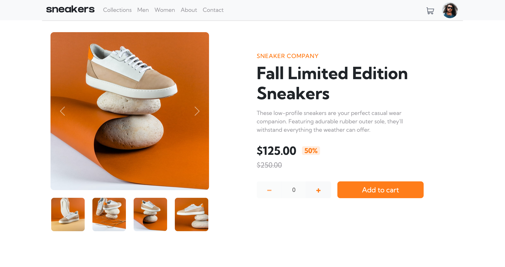

# E-commerce product page

This is a solution to the [E-commerce product page challenge on Frontend Mentor](https://www.frontendmentor.io/challenges/ecommerce-product-page-UPsZ9MJp6).

## Overview

Build out e-commerce page with the following functionality

Users should be able to:

- View the optimal layout for the site depending on their device's screen size
- See hover states for all interactive elements on the page
- Open a lightbox gallery by clicking on the large product image
- Switch the large product image by clicking on the small thumbnail images
- Add items to the cart
- View the cart and remove items from it

### Screenshot




- Live Site URL: [https://atmkcmo.github.io/FM-ecommerce-product-page/](https://atmkcmo.github.io/FM-ecommerce-product-page/)


### Built with

- Sass
- Bootstap 5
- Parcel
- Vue 2


## Project Setup

```sh
npm install
```

### Compile and Hot-Reload for Development

```sh
npm start
```

### Compile and Minify for Production

```sh
npx parcel build
```


## Author

- LinkedIn - [Adam McKee](https://www.linkedin.com/in/admckee/)
